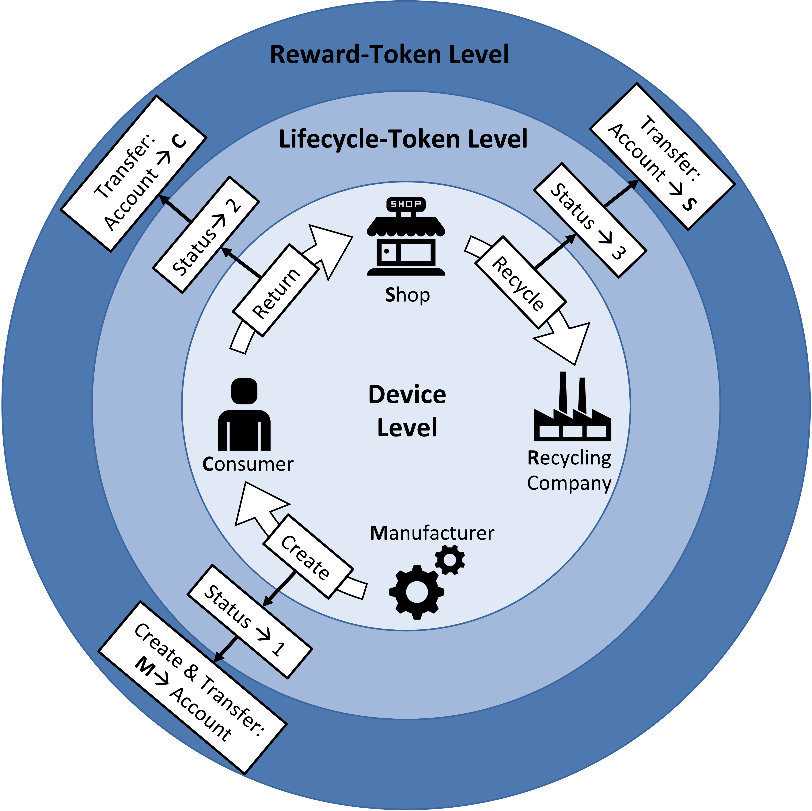

# emine2

**Online project documentation is available [here](https://drive.google.com/file/d/1wMGq06t0IfF60ZZZzxZNUyj5lB4HbORA/view?usp=sharing).**

Electrical and electronic devices contain variable amount of chemical elements which can be hazardous but also valuable. Despite the specific legislations issued to regulate the manufacturer responsibility to close the life-cycle of the products, most of the e-waste still ends up in landfills with a big impact on environment. This problem is even more serious considering also the increasing trend of annual global production of e-waste (see Figure 1). This problem exists mainly because consumers of electric and electronic devices have no incentives to return the products after utilization.

Emine provides manufacturers, shops and consumers a token economy that incentives them to contribute the process of recycling of e-waste. 

 - <b>Manufacturers</b> can track the lifecycle information of any electronical device that they produce. They can also use this information for public recognition.  
 
 - <b>Consumers</b> earn EMineRewardToken for each electronical device that they return, these tokens can be used for discounts at electronics shops.
 
 - <b>Shops</b> earn EMineRewardToken for each electronical device that they recycle, these tokens can be used for discounts at manufacturers.

# Team
Marie Hoes  
Orhun Özbek  
Marco Gigantino  
Tomislav Lipic  
Zanis Timsans 

